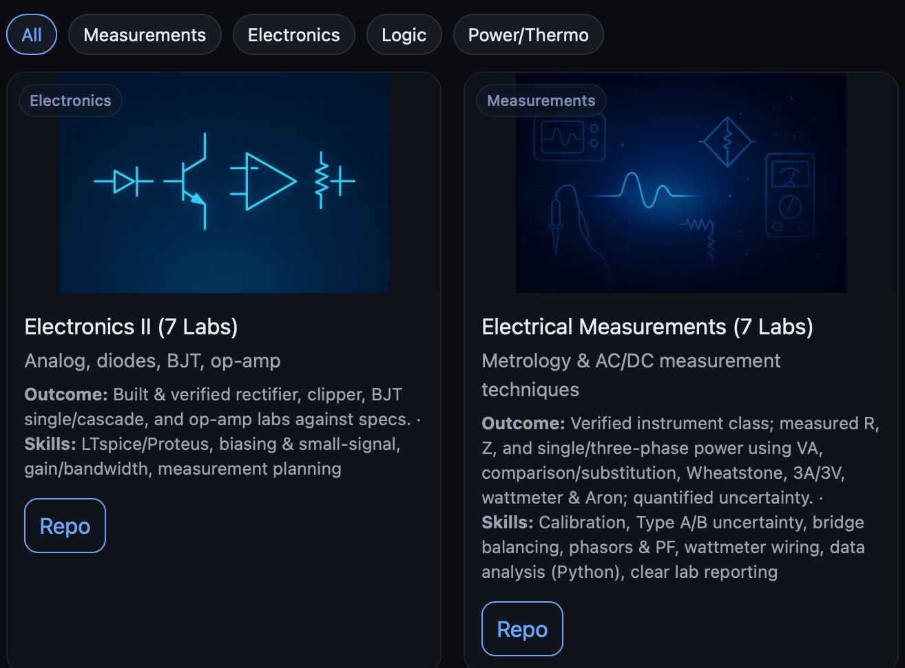

# Clément — Engineering Portfolio

<p align="center">
  <a href="https://yoficlemy.github.io/academic-portfolio/">
    
  </a>
</p>
<p align="center">
  <a href="https://yoficlemy.github.io/academic-portfolio/">
    
  </a>
  <a href="docs/assets/Clement_CV.pdf">
    
  </a>
</p>

[](https://yoficlemy.github.io/academic-portfolio/)
[](https://github.com/YofiClemy/academic-portfolio/actions/workflows/pages/pages-build-deployment)

- 🌐 Live site: **https://yoficlemy.github.io/academic-portfolio/**
- 📄 CV: [`docs/assets/Clement_CV.pdf`](docs/assets/Clement_CV.pdf)

# Academic Portfolio — Labs and Projects

> Selected lab reports and projects for Electrical Engineering coursework (UNSE FCEyT).

This repo is organized with one-minute READMEs in each project, then full report PDFs, data and code.

## Contents
- `electronics/` analog/digital electronics labs
- `measurements/` measurement setups with uncertainty and propagation
- `logics/` logic systems, timing/state diagrams, HDL/testbench
- `machines/` Rankine cycle and internal combustion analyses
- `Portfolio.pdf` one-page index with links

## Structure per project
```
<project>/
  README.md              # ≤1 min read
  report.pdf             # translated report
  figures/               # plots, photos
  data/                  # CSV raw/processed
  code/                  # LTspice/Proteus/MATLAB/Python/Verilog
  es/                    # original spanish report
```

**Skills & Techniques across projects**  
4-wire resistance, ADC calibration, Wheatstone, VA short/long connections, instrument class estimation, Bode from step response, LTspice, Proteus, MATLAB, Python, uncertainty propagation, HDL/testbench, timing/state diagrams.

Licensing: Code under MIT. Docs/figures under CC BY-NC 4.0.
