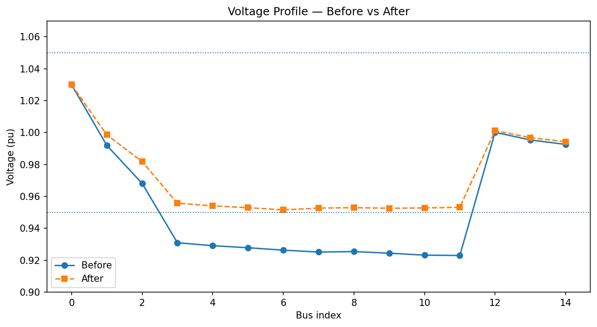

# Minimal Feeder Study — Load-Flow & Short-Circuit

## Results at first glance

## Report (English)

[Report.pdf](/academic-portfolio/power-studies-feeder/report.pdf)

## Aim
	•	Build a balanced MV feeder test network.
	•	Run steady-state load-flow and IEC 60909 short-circuit.
	•	Explore small corrective actions (OLTC, shunt capacitor, targeted rebalance).
	•	Select the smallest action that meets planning limits and document results.

## Background (Theory, quick)
	•	Load-flow computes bus voltages and element currents for a snapshot of P/Q → results in per-unit (pu).
	•	Short-circuit (IEC 60909) estimates symmetrical fault currents (max/min cases) for protection studies.
	•	OLTC raises/lowers LV voltage in steps (≈1–1.5%/tap). Good for band-keeping, not for real-power overloads.
	•	Shunt capacitor injects MVAr locally → reduces reactive current and lifts voltage, especially at the weak end.
	•	Targeted rebalance shifts some load off an overloaded transformer/feeder to a neighbor with headroom.

## Equipment / Software
	•	Python 3.13
	•	pandapower==3.1.2, pandas==2.3.2, matplotlib==3.8.*
	•	Test system: CIGRE MV benchmark (via pandapower.networks)

pip install -r requirements.txt
python scripts/run_study.py
\\Export res_bus, res_line, res_trafo, res_bus_sc to data/*.csv. Plot baseline voltage profile.

## Method (Procedure)
	1.	Build & solve baseline
Create CIGRE MV net (no DER), run load-flow, run short-circuit (max case).

	2.	Baseline observations
Export res_bus, res_line, res_trafo, res_bus_sc to data/*.csv. Plot baseline voltage profile.

	3.	Scenarios
	•	OLTC +1/+2 taps (only if a tap exists).
	•	Shunt capacitor sweep at weakest-V bus (0–3 MVAr).
	•	Targeted rebalance on hottest-trafo LV feeder (load scale 1.0→0.85).
	•	Small combos: {1,2 MVAr} × {0.95, 0.90}.
Each scenario is solved and snapshotted with KPIs.

	4.	Selection policy
Filter by limits (Vmin ≥ 0.95 pu, Vmax ≤ 1.05 pu, line/trafo ≤ 100%).
Pick the smallest fix per policy (default: avoid_rebalance).

	5.	Apply & document
Apply the chosen action to a copy of the net, generate before/after plots, and save artifacts.

## Acceptance Limits
	•	Vmin ≥ 0.95 pu
	•	Vmax ≤ 1.05 pu
	•	Line/Trafo loading ≤ 100 %

## Observations (from this run)
	•	Vmin (baseline): 0.923 pu (below limit)
	•	Trafo 0–1: 101.4 % (overloaded) vs Trafo 0–12: 84.7 % (headroom)
	•	Two lines near limit: Line 1–2 (~96.5 %), Line 2–3 (~97.0 %)

## Figures
	•	Voltage profile (before/after): figures/voltage_profile__...png
	•	Stress maps (line/trafo loading): figures/network_stress_before__...png, figures/network_stress_after__...png

## Files & Artifacts
	•	scripts/run_study.py — minimal driver (scenarios + selection).
	•	data/scenario_summary.csv — KPIs for all scenarios.
	•	data/best_scenario__*.json — selected action & KPIs.
	•	data/net_before__*.pkl.gz, data/net_after__*.pkl.gz — full network snapshots.
	•	figures/*.png — plots for the report.

## Discussion
	•	Why the chosen fix? 1 MVAr at the weak bus plus a modest 10% LV feeder rebalance lifts Vmin above 0.95 pu and pulls Trafo 0–1 below 100%, with line max dropping to ~82%.
	•	Alternatives: Larger caps or deeper rebalance also work but are “bigger hammers.” OLTC was unavailable in this model.
	•	Limitations: Cap placement is local; rebalancing assumes feasible tie-switching. Protection checks and seasonal cases are out of scope here.

## Conclusion

A small cap bank (1 MVAr) at bus 11 plus a 10% LV rebalancing is the smallest change meeting planning limits for this case. The workflow is reproducible and easily re-run on other feeders.

## How to Reproduce

pip install -r requirements.txt
python scripts/run_study.py
\\outputs go to data/ and figures/

## Licensing

- **Code:** MIT  
- **Reports & figures:** CC BY-NC 4.0